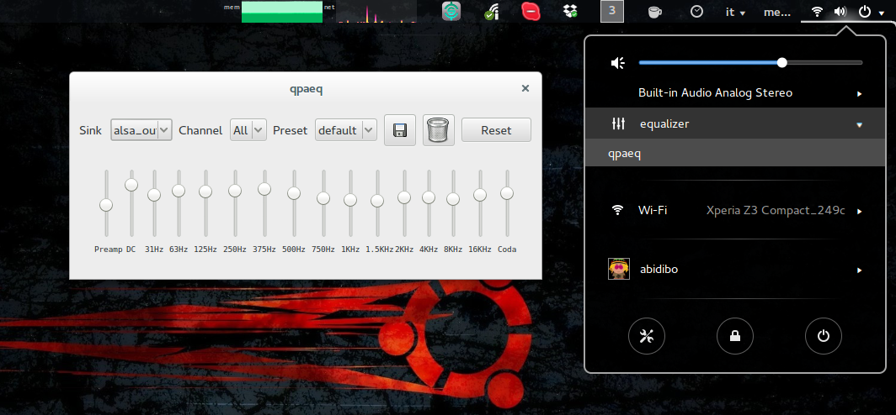

# gnome-shell-qpaeq-launcher

This is a simple gnome extension which adds a "equalizer" menu voice in the status panel of the top bar under the volume controller.
The "eqaulizer"" voice has a sub menu, whose first voice is "qpaeq". When clicked it opens the [qpaeq](http://www.webupd8.org/2013/03/install-pulseaudio-with-built-in-system.html) equalizer application.

## Installation

Use git:

    git clone git@github.com:kgaut/gnome-shell-qpaeq-launcher.git ~/.local/share/gnome-shell/extensions/gnome-shell-qpaeq-launcher@abidibo

Then restart the gnome-shell via alt+F2 r and enable the extension using gnome-tweak-tool, or use gsettings command line tool.

To update later, just issue

(cd ~/.local/share/gnome-shell/extensions/gnome-shell-qpaeq.launcher@abidibo && git pull)

